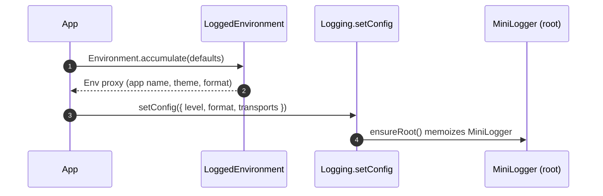
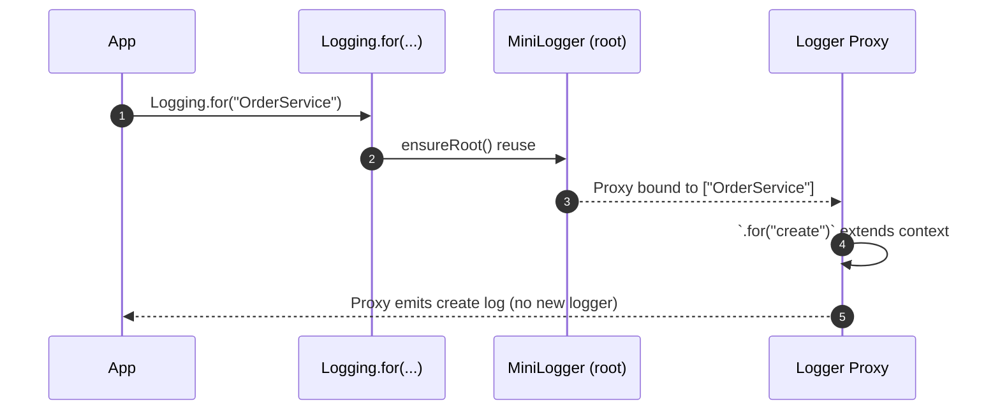
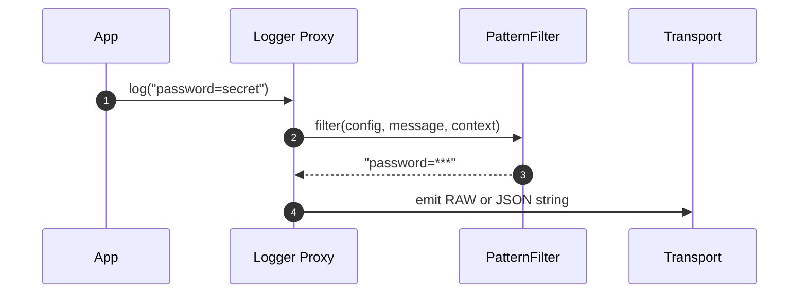
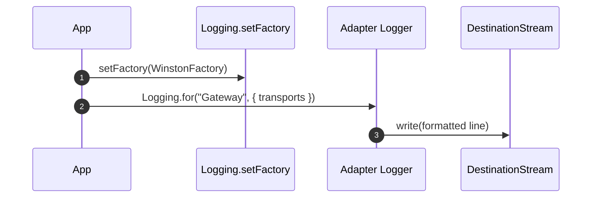
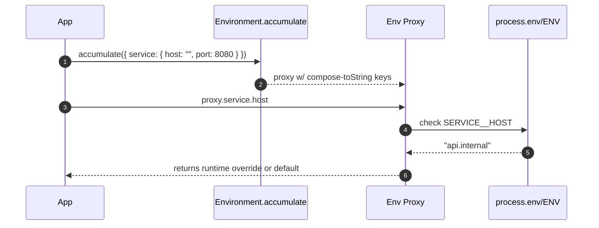
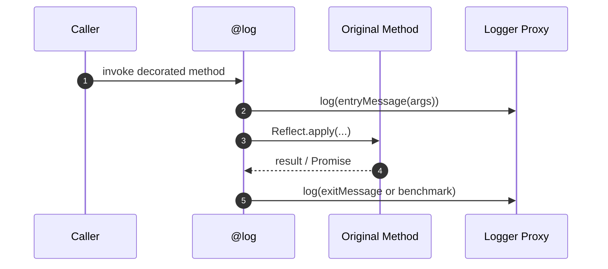

<!-- AUTO-GENERATED: logging/workdocs/1-Header.md -->


# Logging Library (decaf-ts/logging)

Decaf’s logging toolkit keeps one fast MiniLogger at the core while exposing adapters, filters, and utilities that fit both browser and Node.js runtimes:
- Configure once through `Logging.setConfig` or the `Environment` accumulator and let impersonated child loggers inherit overrides without allocations.
- Apply filter chains, transports, and adapter-specific features (Pino, Winston, custom factories) through the shared `LoggingConfig` contract.
- Instrument classes using decorators, `LoggedClass`, and `Logging.because` while StopWatch, text/time utilities, and environment helpers round out the diagnostics surface.


[](https://github.com/decaf-ts/logging/actions/workflows/nodejs-build-prod.yaml)
[](https://github.com/decaf-ts/logging/actions/workflows/codeql-analysis.yml)[](https://github.com/decaf-ts/logging/actions/workflows/snyk-analysis.yaml)
[](https://github.com/decaf-ts/logging/actions/workflows/pages.yaml)
[](https://github.com/decaf-ts/logging/actions/workflows/release-on-tag.yaml)


Documentation available [here](https://decaf-ts.github.io/logging/)

Minimal size: 6 KB kb gzipped


# Logging Library — Detailed Description

The logging package is a lightweight, extensible logging solution for TypeScript projects. It centers on two main constructs:
- MiniLogger — a minimal, context-aware logger used by default.
- Logging — a static facade that manages global configuration, creates loggers for classes/functions/strings, and applies optional theming.

It also offers:
- A concise set of decorators (log, debug, info, verbose, silly) to instrument methods with consistent logging and optional benchmarking.
- Pluggable factories so that alternate implementations (e.g., WinstonLogger) can be used without changing call sites.
- Strong typing for configuration and theming primitives.

Core files and their roles
- src/types.ts: Type definitions and contracts
  - Logger: the runtime contract with methods silly, verbose, info, debug, error, for, setConfig.
  - LoggingConfig: runtime configuration for filtering, formatting, and styling.
  - LoggerFactory: factory signature returning a Logger for a given context and optional config.
  - Theme/ThemeOption/ThemeOptionByLogLevel: shape of color and style configuration, optionally varying by LogLevel.
  - Additional helpers: StringLike, AnyFunction, Class, LoggingContext.

- src/constants.ts: Defaults and enums
  - LogLevel: error | info | verbose | debug | silly (string values), plus NumericLogLevels for filtering.
  - LoggingMode: RAW | JSON (current implementation focuses on RAW; JSON is available for adapters like Winston).
  - DefaultTheme: sensible default colors/styles per component and per log level.
  - DefaultLoggingConfig: default global configuration (info level, no styling, timestamp on, etc.).

- src/logging.ts: Implementations and static facade
  - MiniLogger: A small, dependency-light logger that:
    - Generates formatted log strings (timestamp, log level, context, correlation id, message, stack) according to config.
    - Supports child loggers via .for(method|config) with a Proxy to overlay per-child config and extend the context (class.method).
    - Emits to console.log/console.debug/console.error based on level. Verbosity controls .silly output (gated by config.verbose).
  - Logging: The static entry point that:
    - Holds global configuration (Logging.getConfig(), Logging.setConfig()).
    - Creates loggers for arbitrary contexts (Logging.for(object|class|function|string, config?)).
    - Provides convenience static logging methods (info, debug, error, verbose, silly) delegating to a global logger instance.
    - Supports theming (Logging.theme) by applying Theme options through styled-string-builder when style=true.
    - Allows replacing the logger factory (Logging.setFactory) to integrate with other backends (e.g., Winston).

- src/decorators.ts: Method decorators
  - log(level=info, benchmark=false, verbosity=0): wraps a method to emit a call log and optionally a completion time; supports Promise-returning methods.
  - debug/info/silly/verbose: concise wrappers around log() for common patterns.

- src/LoggedClass.ts: Base convenience class
  - LoggedClass exposes a protected this.log getter returning a context-aware Logger built via Logging.for(this), simplifying logging inside class methods.

- src/winston/winston.ts: Optional Winston adapter
  - WinstonLogger: extends MiniLogger but delegates emission to a configured Winston instance.
  - WinstonFactory: a LoggerFactory you can install with Logging.setFactory(WinstonFactory) to globally route logs through Winston.

Design principles
- Minimal by default: Console output with small surface area and no heavy dependencies (except styled-string-builder when style is enabled).
- Config-driven: Behavior (level thresholds, verbosity, timestamps, separators, theming) is controlled via LoggingConfig.
- Context-first: Log context is explicit ("MyClass" or "MyClass.method"), aiding filtering and debugging.
- Extensible: Swap logger implementations via a factory; MiniLogger serves as a reference implementation.
- Safe theming: Logging.theme guards against invalid theme keys and values and logs errors instead of throwing.

Key behaviors
- Level filtering: NumericLogLevels are used to compare configured level with the message level and decide emission.
- Verbosity: .silly obeys LoggingConfig.verbose; only messages with <= configured verbosity are emitted.
- Theming and styling: When style=true, Logging.theme applies Theme rules per component (class, message, logLevel, id, stack, timestamp). Theme can vary per LogLevel via ThemeOptionByLogLevel.
- Correlation IDs: If correlationId is configured in a logger or child logger, it is included in output for easier traceability.

Public API surface
- Classes: MiniLogger, Logging, LoggedClass; WinstonLogger (optional).
- Decorators: log, debug, info, verbose, silly.
- Enums/Consts: LogLevel, LoggingMode, NumericLogLevels, DefaultTheme, DefaultLoggingConfig.
- Types: Logger, LoggingConfig, LoggerFactory, Theme, ThemeOption, ThemeOptionByLogLevel, LoggingContext.

Intended usage
- Use Logging.setConfig() at application startup to set level/style/timestamps.
- Create class- or method-scoped loggers via Logging.for(MyClass) or logger.for('method').
- Adopt LoggedClass to remove boilerplate in classes.
- Add decorators to methods for automatic call/benchmark logs.
- For advanced deployments, swap to WinstonFactory.


# How to Use the Logging Library

All snippets import from `@decaf-ts/logging` (swap to a relative path when working inside this repo). Each item below contains a short description, an optional sequence diagram for complex flows, and runnable TypeScript code.

## 1. Bootstrapping Global Configuration
Description: Initialize `Logging` once (or hydrate `LoggedEnvironment`) to define levels, formatting, colors, transports, and app identifiers that downstream impersonated loggers inherit without per-call overhead.



```ts
import { Logging, LogLevel, DefaultLoggingConfig, LoggedEnvironment } from "@decaf-ts/logging";

// seed the environment before configuring Logging.
LoggedEnvironment.accumulate({
  app: "InventoryAPI",
  logging: { separator: "•" },
});

Logging.setConfig({
  ...DefaultLoggingConfig,
  level: LogLevel.debug,
  verbose: 2,
  style: true,
  format: "raw",
});

Logging.info("Boot complete");
Logging.verbose("Dependency graph built", 1);
Logging.silly("Deep diagnostics", 3); // ignored because verbose < 3
```

## 2. Impersonation & Proxy Performance
Description: ONE `MiniLogger` instance powers every context. Calls to `.for(...)` return lightweight proxies that temporarily override context/config without allocating new drivers, so a hot path can derive thousands of child loggers without GC churn.



```ts
import { Logging, LogLevel, type LoggingConfig } from "@decaf-ts/logging";

Logging.setConfig({ level: LogLevel.info });
const logger = Logging.for("OrderService");

function runScenario(overrides?: Partial<LoggingConfig>) {
  const scoped = logger.for("createOrUpdate", overrides);
  scoped.info("Validating payload");
  scoped.for("db").debug("Executing UPSERT..."); // reuses the same proxy target
  scoped.clear(); // resets context/config so the proxy can serve the next call
}

runScenario({ correlationId: "req-1" });
runScenario({ correlationId: "req-2", style: false });
```

## 3. Filtering Sensitive Data
Description: Attach `PatternFilter` or custom filters via `LoggingConfig.filters` to redact PII/passwords before formatting. Filters run on the message string after it was rendered in RAW format; JSON output serializes the already-filtered content, so sensitive values disappear in both outputs.



```ts
import { Logging, LogLevel, PatternFilter, type LoggingConfig } from "@decaf-ts/logging";

class PiiFilter extends PatternFilter {
  constructor() {
    super(/(password|ssn)=([^&\s]+)/gi, (_full, key) => `${key}=***`);
  }
}

const filters: LoggingConfig["filters"] = [new PiiFilter()];
Logging.setConfig({
  level: LogLevel.debug,
  filters,
  format: "raw",
});

const logger = Logging.for("SignupFlow");
logger.info("Attempt password=abc123&email=user@example.com"); // prints password=***

Logging.setConfig({ format: "json" });
logger.info("ssn=123-45-6789"); // JSON payload contains ssn=*** already
```

## 4. Transports & Custom Destinations
Description: Supply writable streams via `LoggingConfig.transports` when using adapters (Pino/Winston) to branch logs to files, sockets, or monitoring systems. Each adapter inspects `transports` and builds either a native transport (Winston) or Pino multistream.



```ts
import fs from "node:fs";
import { Logging, LogLevel } from "@decaf-ts/logging";
import { WinstonFactory } from "@decaf-ts/logging/winston/winston";
import Transport from "winston-transport";

class AuditTransport extends Transport {
  log(info: any, callback: () => void) {
    fs.appendFileSync("audit.log", `${info.message}\n`);
    callback();
  }
}

Logging.setFactory(WinstonFactory);
const auditLogger = Logging.for("AuditTrail", {
  level: LogLevel.info,
  transports: [new AuditTransport()],
});

auditLogger.info("policy=PASSWORD_RESET user=u-9 timestamp=...");
```

## 5. Pino & Winston Native Features
Description: Use `PinoLogger` and `WinstonLogger` directly (or via `Logging.setFactory`) to access adapter-only functions such as `child()`, `flush()`, or Pino/Winston-specific levels while still honoring the shared `LoggingConfig`.

```ts
import pino from "pino";
import { Logging, LogLevel } from "@decaf-ts/logging";
import { PinoLogger, PinoFactory } from "@decaf-ts/logging/pino/pino";
import { WinstonLogger } from "@decaf-ts/logging/winston/winston";

// Pino: reuse an existing driver and call child()
const sink = pino({ level: "trace", name: "Api" });
const pinoLogger = new PinoLogger("Api", { level: LogLevel.debug }, sink);
pinoLogger.child({ context: "handler" }).info("Child context respects config");
pinoLogger.flush?.();

// Register the adapter globally so Logging.for uses it
Logging.setFactory(PinoFactory);
Logging.for("BatchJob").debug("Runs through native Pino now");

// Winston: pass custom transports or formats through LoggingConfig
const winstonLogger = new WinstonLogger("Worker", {
  transports: [
    new (WinstonLogger as any).prototype.winston.transports.Console(), // or custom
  ],
  correlationId: "cid-1",
});
winstonLogger.error("Failure");
```

## 6. Environment Accumulator & Runtime Overrides
Description: `Environment.accumulate` builds a proxy whose properties resolve to runtime ENV variables (Node or browser) with helpers such as `keys`, `get`, and `orThrow`. Extend the shape by calling `accumulate` repeatedly; an empty string marks required values.



```ts
import { Environment, LoggedEnvironment } from "@decaf-ts/logging/environment";

// Extend the singleton shape; string "" means "required"
const Config = Environment.accumulate({
  service: { host: "", port: 8080 },
  logging: LoggedEnvironment,
});

console.log(String((Config as any).service.host)); // SERVICE__HOST
console.log(Environment.keys()); // ["SERVICE", "LOGGING", ...]

// Fail fast when required env is missing or empty
const runtime = Config.orThrow();
const serviceHost = runtime.service.host; // throws if missing at runtime

// Programmatic lookups
const verbose = Environment.get("logging.verbose");
```

## 7. LoggedClass for Drop-in Contextual Logging
Description: Extend `LoggedClass` to gain a protected `this.log` that’s already scoped to the subclass and works with decorators, impersonation, and adapters.

```ts
import { LoggedClass, Logging, LogLevel } from "@decaf-ts/logging";

Logging.setConfig({ level: LogLevel.info });

class EmailService extends LoggedClass {
  async send(to: string, template: string) {
    this.log.info(`Dispatching template=${template} to ${to}`);
    return true;
  }
}

const svc = new EmailService();
await svc.send("user@example.com", "welcome");
```

## 8. StopWatch for Benchmarking
Description: `StopWatch` uses the highest resolution clock available (browser `performance.now`, Node `process.hrtime.bigint`, or `Date.now`) to measure laps, pause/resume, and report JSON snapshots—useful for the `@benchmark` decorator or manual instrumentation.

```ts
import { StopWatch } from "@decaf-ts/logging/time";

const sw = new StopWatch(true);
await new Promise((r) => setTimeout(r, 15));
sw.lap("load config");
sw.pause();

await new Promise((r) => setTimeout(r, 5)); // paused time ignored
sw.resume();
await new Promise((r) => setTimeout(r, 10));
const lap = sw.lap("connect db");
console.log(lap.ms, lap.totalMs, sw.toString());
console.log(JSON.stringify(sw));
```

## 9. Decorators & Advanced Instrumentation
Description: Use the stock decorators (`@log`, `@debug`, `@info`, `@verbose`, `@silly`, `@benchmark`, `@final`) or extend `@log` to emit structured entry/exit details. Decorators work with `LoggedClass` instances and plain classes alike.



```ts
import {
  log,
  debug,
  info,
  silly,
  verbose,
  benchmark,
  LogLevel,
  LoggedClass,
} from "@decaf-ts/logging";

class CustomLogDecorator {
  static payload(label: string) {
    return log(
      LogLevel.info,
      0,
      (...args) => `${label}: ${JSON.stringify(args)}`,
      (err, result) =>
        err ? `${label} failed: ${err.message}` : `${label} ok: ${result}`
    );
  }
}

class BillingService extends LoggedClass {
  @CustomLogDecorator.payload("charge")
  @benchmark()
  async charge(userId: string, amount: number) {
    if (amount <= 0) throw new Error("invalid amount");
    return `charged:${userId}:${amount}`;
  }

  @debug()
  rebuildIndex() {}

  @info()
  activate() {}

  @silly()
  ping() {}

  @verbose(1)
  sync() {}
}

const svc = new BillingService();
await svc.charge("u-1", 25);
```

## 10. Utility Modules (text, time, utils, web)
Description: Helper functions complement logging by formatting identifiers, generating ENV keys, and detecting runtimes.

```ts
import {
  padEnd,
  patchPlaceholders,
  sf,
  toCamelCase,
  toENVFormat,
  toSnakeCase,
  toKebabCase,
  toPascalCase,
} from "@decaf-ts/logging/text";
import { formatMs, now } from "@decaf-ts/logging/time";
import { getObjectName, isClass, isFunction, isInstance } from "@decaf-ts/logging/utils";
import { isBrowser } from "@decaf-ts/logging/web";

const padded = padEnd("id", 5, "_");               // "id___"
const greeting = patchPlaceholders("Hello ${name}", { name: "Ada" });
const formatted = sf("{0}-{name}", "A", { name: "B" });
const snake = toSnakeCase("HelloWorld Test");      // "hello_world_test"
const envKey = toENVFormat("service.host");        // "SERVICE_HOST"
const camel = toCamelCase("hello world");
const pascal = toPascalCase("hello world");
const kebab = toKebabCase("Hello World");

const duration = formatMs(now() - now()); // hh:mm:ss.mmm string
const typeName = getObjectName(new (class Repo {})());
const runtimeIsBrowser = isBrowser();
const plainFn = () => true;
console.log(isFunction(plainFn), isClass(class A {}), isInstance({})); // type guards
```


### Related

[](https://github.com/decaf-ts/decaf-ts)
[](https://github.com/decaf-ts/core)
[](https://github.com/decaf-ts/decorator-validation)
[](https://github.com/decaf-ts/db-decorators)


### Social

[](https://www.linkedin.com/in/decaf-ts/)


#### Languages


## Getting help

If you have bug reports, questions or suggestions please [create a new issue](https://github.com/decaf-ts/ts-workspace/issues/new/choose).

## Contributing

I am grateful for any contributions made to this project. Please read [this](./workdocs/98-Contributing.md) to get started.

## Supporting

The first and easiest way you can support it is by [Contributing](./workdocs/98-Contributing.md). Even just finding a typo in the documentation is important.

Financial support is always welcome and helps keep both me and the project alive and healthy.

So if you can, if this project in any way. either by learning something or simply by helping you save precious time, please consider donating.

## License

This project is released under the [MIT License](./LICENSE.md).

By developers, for developers...
