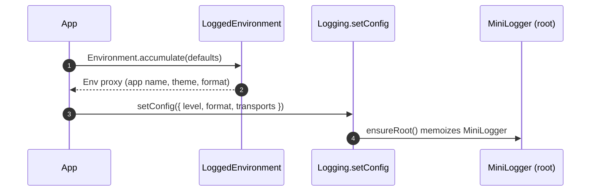
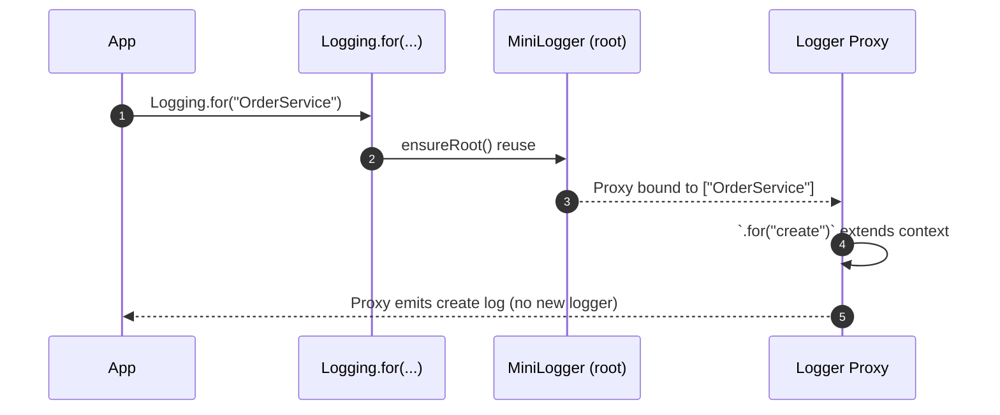
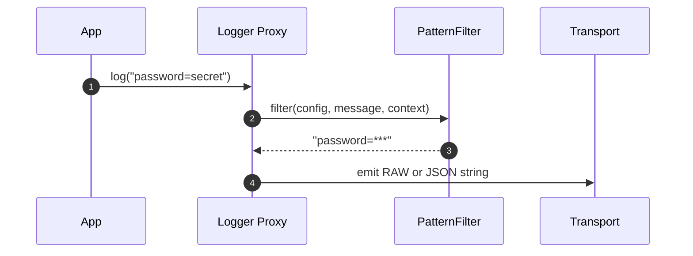
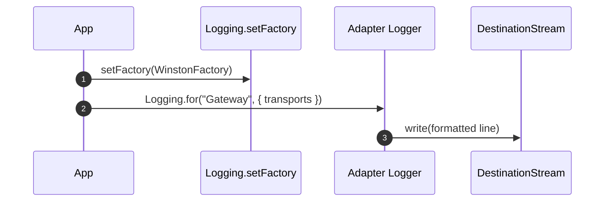
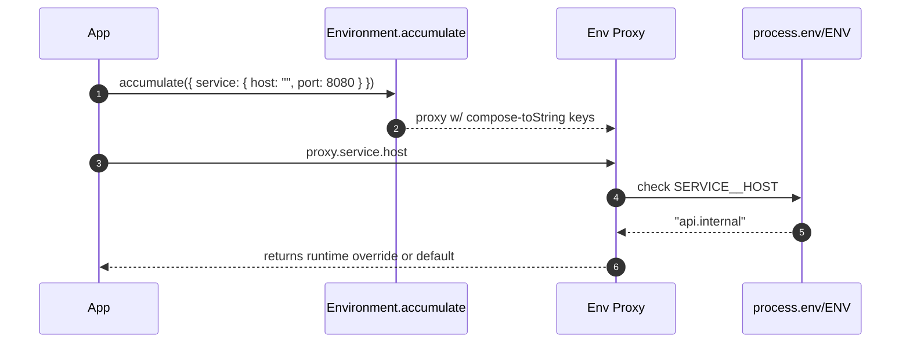
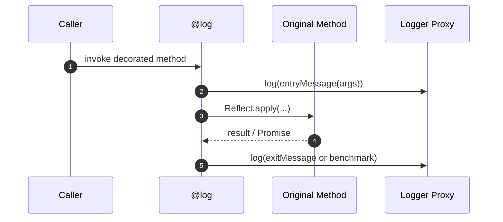

# How to Use the Logging Library

All snippets import from `@decaf-ts/logging` (swap to a relative path when working inside this repo). Each item below contains a short description, an optional sequence diagram for complex flows, and runnable TypeScript code.

## 1. Bootstrapping Global Configuration
Description: Initialize `Logging` once (or hydrate `LoggedEnvironment`) to define levels, formatting, colors, transports, and app identifiers that downstream impersonated loggers inherit without per-call overhead.



```ts
import { Logging, LogLevel, DefaultLoggingConfig, LoggedEnvironment } from "@decaf-ts/logging";

// seed the environment before configuring Logging.
LoggedEnvironment.accumulate({
  app: "InventoryAPI",
  logging: { separator: "•" },
});

Logging.setConfig({
  ...DefaultLoggingConfig,
  level: LogLevel.debug,
  verbose: 2,
  style: true,
  format: "raw",
});

Logging.info("Boot complete");
Logging.verbose("Dependency graph built", 1);
Logging.silly("Deep diagnostics", 3); // ignored because verbose < 3
```

## 2. Impersonation & Proxy Performance
Description: ONE `MiniLogger` instance powers every context. Calls to `.for(...)` return lightweight proxies that temporarily override context/config without allocating new drivers, so a hot path can derive thousands of child loggers without GC churn.



```ts
import { Logging, LogLevel, type LoggingConfig } from "@decaf-ts/logging";

Logging.setConfig({ level: LogLevel.info });
const logger = Logging.for("OrderService");

function runScenario(overrides?: Partial<LoggingConfig>) {
  const scoped = logger.for("createOrUpdate", overrides);
  scoped.info("Validating payload");
  scoped.for("db").debug("Executing UPSERT..."); // reuses the same proxy target
  scoped.clear(); // resets context/config so the proxy can serve the next call
}

runScenario({ correlationId: "req-1" });
runScenario({ correlationId: "req-2", style: false });
```

## 3. Filtering Sensitive Data
Description: Attach `PatternFilter` or custom filters via `LoggingConfig.filters` to redact PII/passwords before formatting. Filters run on the message string after it was rendered in RAW format; JSON output serializes the already-filtered content, so sensitive values disappear in both outputs.



```ts
import { Logging, LogLevel, PatternFilter, type LoggingConfig } from "@decaf-ts/logging";

class PiiFilter extends PatternFilter {
  constructor() {
    super(/(password|ssn)=([^&\s]+)/gi, (_full, key) => `${key}=***`);
  }
}

const filters: LoggingConfig["filters"] = [new PiiFilter()];
Logging.setConfig({
  level: LogLevel.debug,
  filters,
  format: "raw",
});

const logger = Logging.for("SignupFlow");
logger.info("Attempt password=abc123&email=user@example.com"); // prints password=***

Logging.setConfig({ format: "json" });
logger.info("ssn=123-45-6789"); // JSON payload contains ssn=*** already
```

## 4. Transports & Custom Destinations
Description: Supply writable streams via `LoggingConfig.transports` when using adapters (Pino/Winston) to branch logs to files, sockets, or monitoring systems. Each adapter inspects `transports` and builds either a native transport (Winston) or Pino multistream.



```ts
import fs from "node:fs";
import { Logging, LogLevel } from "@decaf-ts/logging";
import { WinstonFactory } from "@decaf-ts/logging/winston/winston";
import Transport from "winston-transport";

class AuditTransport extends Transport {
  log(info: any, callback: () => void) {
    fs.appendFileSync("audit.log", `${info.message}\n`);
    callback();
  }
}

Logging.setFactory(WinstonFactory);
const auditLogger = Logging.for("AuditTrail", {
  level: LogLevel.info,
  transports: [new AuditTransport()],
});

auditLogger.info("policy=PASSWORD_RESET user=u-9 timestamp=...");
```

## 5. Pino & Winston Native Features
Description: Use `PinoLogger` and `WinstonLogger` directly (or via `Logging.setFactory`) to access adapter-only functions such as `child()`, `flush()`, or Pino/Winston-specific levels while still honoring the shared `LoggingConfig`.

```ts
import pino from "pino";
import { Logging, LogLevel } from "@decaf-ts/logging";
import { PinoLogger, PinoFactory } from "@decaf-ts/logging/pino/pino";
import { WinstonLogger } from "@decaf-ts/logging/winston/winston";

// Pino: reuse an existing driver and call child()
const sink = pino({ level: "trace", name: "Api" });
const pinoLogger = new PinoLogger("Api", { level: LogLevel.debug }, sink);
pinoLogger.child({ context: "handler" }).info("Child context respects config");
pinoLogger.flush?.();

// Register the adapter globally so Logging.for uses it
Logging.setFactory(PinoFactory);
Logging.for("BatchJob").debug("Runs through native Pino now");

// Winston: pass custom transports or formats through LoggingConfig
const winstonLogger = new WinstonLogger("Worker", {
  transports: [
    new (WinstonLogger as any).prototype.winston.transports.Console(), // or custom
  ],
  correlationId: "cid-1",
});
winstonLogger.error("Failure");
```

## 6. Environment Accumulator & Runtime Overrides
Description: `Environment.accumulate` builds a proxy whose properties resolve to runtime ENV variables (Node or browser) with helpers such as `keys`, `get`, and `orThrow`. Extend the shape by calling `accumulate` repeatedly; an empty string marks required values.



```ts
import { Environment, LoggedEnvironment } from "@decaf-ts/logging/environment";

// Extend the singleton shape; string "" means "required"
const Config = Environment.accumulate({
  service: { host: "", port: 8080 },
  logging: LoggedEnvironment,
});

console.log(String((Config as any).service.host)); // SERVICE__HOST
console.log(Environment.keys()); // ["SERVICE", "LOGGING", ...]

// Fail fast when required env is missing or empty
const runtime = Config.orThrow();
const serviceHost = runtime.service.host; // throws if missing at runtime

// Programmatic lookups
const verbose = Environment.get("logging.verbose");
```

## 7. LoggedClass for Drop-in Contextual Logging
Description: Extend `LoggedClass` to gain a protected `this.log` that’s already scoped to the subclass and works with decorators, impersonation, and adapters.

```ts
import { LoggedClass, Logging, LogLevel } from "@decaf-ts/logging";

Logging.setConfig({ level: LogLevel.info });

class EmailService extends LoggedClass {
  async send(to: string, template: string) {
    this.log.info(`Dispatching template=${template} to ${to}`);
    return true;
  }
}

const svc = new EmailService();
await svc.send("user@example.com", "welcome");
```

## 8. StopWatch for Benchmarking
Description: `StopWatch` uses the highest resolution clock available (browser `performance.now`, Node `process.hrtime.bigint`, or `Date.now`) to measure laps, pause/resume, and report JSON snapshots—useful for the `@benchmark` decorator or manual instrumentation.

```ts
import { StopWatch } from "@decaf-ts/logging/time";

const sw = new StopWatch(true);
await new Promise((r) => setTimeout(r, 15));
sw.lap("load config");
sw.pause();

await new Promise((r) => setTimeout(r, 5)); // paused time ignored
sw.resume();
await new Promise((r) => setTimeout(r, 10));
const lap = sw.lap("connect db");
console.log(lap.ms, lap.totalMs, sw.toString());
console.log(JSON.stringify(sw));
```

## 9. Decorators & Advanced Instrumentation
Description: Use the stock decorators (`@log`, `@debug`, `@info`, `@verbose`, `@silly`, `@benchmark`, `@final`) or extend `@log` to emit structured entry/exit details. Decorators work with `LoggedClass` instances and plain classes alike.



```ts
import {
  log,
  debug,
  info,
  silly,
  verbose,
  benchmark,
  LogLevel,
  LoggedClass,
} from "@decaf-ts/logging";

class CustomLogDecorator {
  static payload(label: string) {
    return log(
      LogLevel.info,
      0,
      (...args) => `${label}: ${JSON.stringify(args)}`,
      (err, result) =>
        err ? `${label} failed: ${err.message}` : `${label} ok: ${result}`
    );
  }
}

class BillingService extends LoggedClass {
  @CustomLogDecorator.payload("charge")
  @benchmark()
  async charge(userId: string, amount: number) {
    if (amount <= 0) throw new Error("invalid amount");
    return `charged:${userId}:${amount}`;
  }

  @debug()
  rebuildIndex() {}

  @info()
  activate() {}

  @silly()
  ping() {}

  @verbose(1)
  sync() {}
}

const svc = new BillingService();
await svc.charge("u-1", 25);
```

## 10. Utility Modules (text, time, utils, web)
Description: Helper functions complement logging by formatting identifiers, generating ENV keys, and detecting runtimes.

```ts
import {
  padEnd,
  patchPlaceholders,
  sf,
  toCamelCase,
  toENVFormat,
  toSnakeCase,
  toKebabCase,
  toPascalCase,
} from "@decaf-ts/logging/text";
import { formatMs, now } from "@decaf-ts/logging/time";
import { getObjectName, isClass, isFunction, isInstance } from "@decaf-ts/logging/utils";
import { isBrowser } from "@decaf-ts/logging/web";

const padded = padEnd("id", 5, "_");               // "id___"
const greeting = patchPlaceholders("Hello ${name}", { name: "Ada" });
const formatted = sf("{0}-{name}", "A", { name: "B" });
const snake = toSnakeCase("HelloWorld Test");      // "hello_world_test"
const envKey = toENVFormat("service.host");        // "SERVICE_HOST"
const camel = toCamelCase("hello world");
const pascal = toPascalCase("hello world");
const kebab = toKebabCase("Hello World");

const duration = formatMs(now() - now()); // hh:mm:ss.mmm string
const typeName = getObjectName(new (class Repo {})());
const runtimeIsBrowser = isBrowser();
const plainFn = () => true;
console.log(isFunction(plainFn), isClass(class A {}), isInstance({})); // type guards
```
